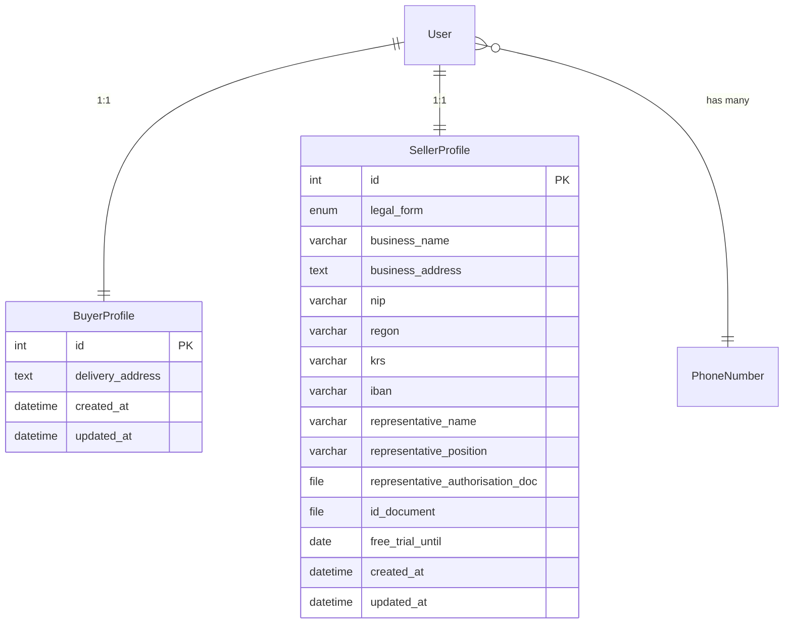

# Users Module Architecture: Buyer & Seller Profiles

## Introduction
This document defines the architecture for the **users** Django application that will store additional profile information for marketplace participants. A single Django `User` instance can simultaneously possess **buyer** and **seller** roles; therefore, two distinct profile models are introduced.

* **`BuyerProfile`** – stores delivery details.
* **`SellerProfile`** – stores business identity, invoicing, banking and AML-required fields for both sole traders and legal entities.

> **Update (2025-06-27):** Phone numbers are now managed by the dedicated `PhoneNumber` model. The `phone_number` columns mentioned later in this document are **legacy** and will be removed in the next iteration. See [004.2a Phone Numbers Architecture](004.2a-phone-numbers-arch-en.md) for full details.

The purpose of this document is to serve as a clear implementation guide for backend developers and reviewers.

A single Django `User` is identified *primarily* by their **phone number** (mandatory, globally unique) and *optionally* an **email address**. The tuple `(phone_number, email)` must be unique – no two accounts can share the same phone or the same e-mail.

A single Django `User` is identified by a mandatory, globally unique **phone number** and an optional, globally unique **email address**. No two user accounts may share the same phone number or email.

---

## High-Level Overview

* The **users** app lives alongside `core` in the project and depends only on `django.contrib.auth` (or `settings.AUTH_USER_MODEL`).
* Both profiles use a **One-To-One** relationship to the main `User` table, ensuring uniqueness while allowing either, both, or none profiles for a user.

---

## Data Model Details
### Common Conventions
1. **User Identity** – the `User` table stores `phone_number` (mandatory, `unique=True`) and `email` (optional, `unique=True`, may be blank). The built-in `username` field is suppressed/unused.
2. **Timestamps** – every model inherits from an abstract `TimeStampedModel` that adds `created_at` and `updated_at` (`auto_now_add=True`, `auto_now=True`).
3. **Phone Numbers** – stored as raw strings for MVP. Later we can migrate to `django-phonenumber-field`.
4. **Email** – stored independently from the login email to support scenario where a user uses different emails for transactions.
5. **Indexes & Constraints** – the `user` field is `Unique=True`; frequently filtered fields (`nip`) receive DB indexes.

### `BuyerProfile`
| Field | Type | Null | Notes |
|-------|------|------|-------|
| `id` | AutoField (PK) | No | |
| `user` | OneToOne → `AUTH_USER_MODEL` | No | `related_name="buyer_profile"` |
| `delivery_address` | TextField | No | Full delivery address |
| `created_at` / `updated_at` | DateTime | No | From `TimeStampedModel` |

Validation Rules:
(No additional validation rules).

### `SellerProfile`
| Field | Type | Null | Notes |
|-------|------|------|-------|
| `id` | AutoField (PK) | No | |
| `user` | OneToOne → `AUTH_USER_MODEL` | No | `related_name="seller_profile"` |
| `legal_form` | CharField(16) | No | `sole_trader` / `legal_entity` |
| `business_name` | CharField(128) | No | Legal entity or trade name |
| `business_address` | TextField | No | Registered or business address |
| `nip` | CharField(20) | No | Tax ID (NIP in PL) |
| `regon` | CharField(14) | Yes | Statistical registry number |
| `krs` | CharField(10) | Yes | Company registry number (required if `legal_entity`) |
| `iban` | CharField(34) | No | Bank account for payouts |
| `representative_name` | CharField(128) | Yes | Legal representative (for `legal_entity`) |
| `representative_position` | CharField(64) | Yes | Position/title |
| `representative_authorisation_doc` | FileField | Yes | Proof of authority |
| `id_document` | FileField | Yes | ID document (required if `sole_trader`) |
| `free_trial_until` | DateField | Yes | Free subscription end |
| `created_at` / `updated_at` | DateTime | No | From `TimeStampedModel` |

Validation Rules:
* `nip` must match Polish NIP format `^(\\d{10})$`.
* If `legal_form == 'legal_entity'`, field `krs` is **required** and `id_document` may be `NULL`.
* If `legal_form == 'sole_trader'`, field `id_document` is **required** and `krs` is `NULL`.

---

## Project Structure Changes
```plaintext
czesci/
└── czesci/
    └── users/              # NEW app (added to INSTALLED_APPS)
        ├── __init__.py
        ├── admin.py
        ├── apps.py
        ├── migrations/
        ├── models.py       # BuyerProfile, SellerProfile, TimeStampedModel
        ├── tests.py
        └── ...
```
Add `"users"` to `INSTALLED_APPS` in `settings/main.py`.

---

## User ↔ Profile Relationships & Behaviour
1. A single `User` **may** possess a `BuyerProfile`, a `SellerProfile`, or **both**. Profiles are created on demand.
2. During registration, the user selects their initial role(s). They can later activate the missing profile at any time (e.g., "Become Seller").
3. Contact data inside profiles *may differ* from the master `User` phone/email (e.g., company support number). Supplying different values is optional – when omitted, application falls back to `User` fields.
4. The `User.phone_number` and `User.email` remain globally unique across the entire system; profile-level phone/emails are not required to be unique because they are secondary contacts.

---

## Open Questions / Next Steps
1. Should we normalise address into a separate reusable model? For now we embed directly for simplicity.
2. Define admin UI split (buyer/seller tabs) – out of scope for this architecture but must be included in implementation tasks.

---

## Definition of Done (Architectural)
- Document approved by PO & Lead Dev.
- Users app scaffolding added.
- Migrations generate without errors.
- Unit tests asserting model invariants and cross-profile independence pass.

---

_Authored by Wojtek (Architect) – {date to be filled automatically by version control}_