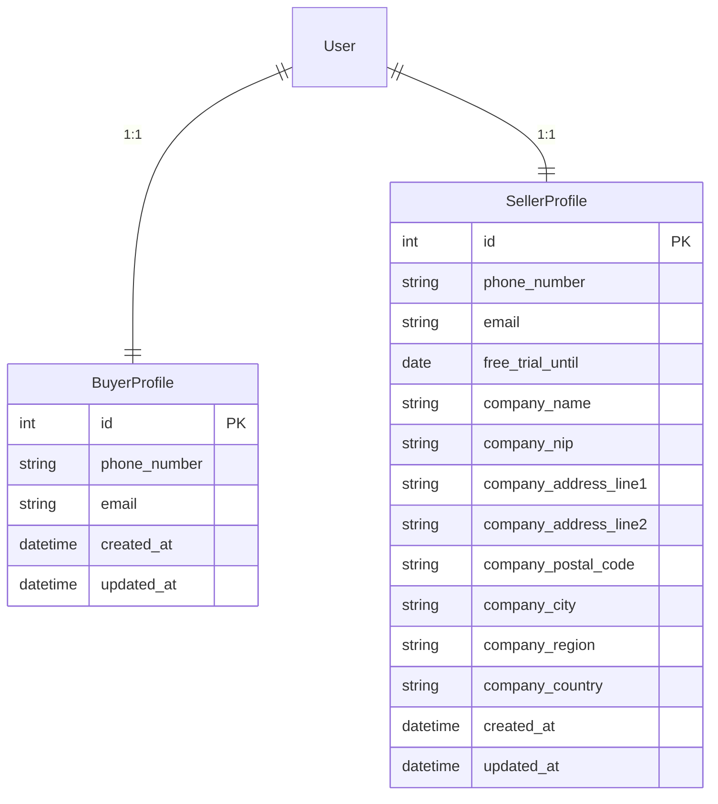

# Users Module Architecture: Buyer & Seller Profiles

## Introduction
This document defines the architecture for the **users** Django application that will store additional profile information for marketplace participants. A single Django `User` instance can simultaneously possess **buyer** and **seller** roles; therefore, two distinct profile models are introduced.

* **`BuyerProfile`** – keeps dedicated contact data used when the user acts as a buyer.
* **`SellerProfile`** – extends the buyer-level data with fields required for invoicing and a free-trial indicator.

The purpose of this document is to serve as a clear implementation guide for backend developers and reviewers.

---

## High-Level Overview

* The **users** app lives alongside `core` in the project and depends only on `django.contrib.auth` (or `settings.AUTH_USER_MODEL`).
* Both profiles use a **One-To-One** relationship to the main `User` table, ensuring uniqueness while allowing either, both, or none profiles for a user.

---

## Data Model Details
### Common Conventions
1. **Timestamps** – every model inherits from an abstract `TimeStampedModel` that adds `created_at` and `updated_at` (`auto_now_add=True`, `auto_now=True`).
2. **Phone Numbers** – stored as raw strings for MVP. Later we can migrate to `django-phonenumber-field`.
3. **Email** – stored independently from the login email to support scenario where a user uses different emails for transactions.
4. **Indexes & Constraints** – the `user` field is `Unique=True`; frequently filtered fields (`phone_number`, `company_nip`) receive DB indexes.

### `BuyerProfile`
| Field | Type | Null | Notes |
|-------|------|------|-------|
| `id` | AutoField (PK) | No | |
| `user` | OneToOne → `AUTH_USER_MODEL` | No | `related_name="buyer_profile"` |
| `phone_number` | CharField(32) | No | Mandatory buyer contact phone |
| `email` | EmailField | Yes | Optional buyer contact email |
| `created_at` / `updated_at` | DateTime | No | From `TimeStampedModel` |

Validation Rules:
* At least one of `phone_number` or `email` **must** be provided – enforced at model clean or form level.
* `phone_number` **must** be provided – enforced at model clean or form level.

### `SellerProfile`
Extends `BuyerProfile` conceptually but implemented as a separate table for clarity and to avoid nullable invoicing columns in buyer records.

| Field | Type | Null | Notes |
|-------|------|------|-------|
| `id` | AutoField (PK) | No | |
| `user` | OneToOne → `AUTH_USER_MODEL` | No | `related_name="seller_profile"` |
| `phone_number` | CharField(32) | No | Mandatory seller contact phone |
| `email` | EmailField | Yes | Optional seller contact email |
| `free_trial_until` | DateField | Yes | Free subscription period end date |
| `company_name` | CharField(128) | Yes | Legal entity name |
| `company_nip` | CharField(20) | Yes | Tax ID (NIP in PL) |
| `company_address_line1` | CharField(128) | Yes | Street + Number |
| `company_address_line2` | CharField(128) | Yes | Additional address info |
| `company_postal_code` | CharField(12) | Yes | ZIP / Postal code |
| `company_city` | CharField(64) | Yes | City |
| `company_region` | CharField(64) | Yes | State / Voivodeship |
| `company_country` | CharField(64) | Yes | ISO country name or code |
| `created_at` / `updated_at` | DateTime | No | From `TimeStampedModel` |

Validation Rules:
* If **any** invoicing field is provided, **all** mandatory invoicing fields (`company_name`, `company_nip`, `company_address_line1`, `company_postal_code`, `company_city`, `company_country`) must be non-null.
* `company_nip` must match Polish NIP format: `^
        (\d{10})$` or a placeholder for other locales.
* `phone_number` **must** be provided – enforced at model clean or form level.

---

## Project Structure Changes
```plaintext
czesci/
└── czesci/
    └── users/              # NEW app (added to INSTALLED_APPS)
        ├── __init__.py
        ├── admin.py
        ├── apps.py
        ├── migrations/
        ├── models.py       # BuyerProfile, SellerProfile, TimeStampedModel
        ├── tests.py
        └── ...
```
Add `"czesci.users"` to `settings/base.py` (or `settings/main.py` in current structure).

---

## Open Questions / Next Steps
1. Should we normalise address into a separate reusable model? For now we embed directly for simplicity.
2. Decide on installing **django-phonenumber-field** for typed phone validation.
3. Define admin UI split (buyer/seller tabs) – out of scope for this architecture but must be included in implementation tasks.

---

## Definition of Done (Architectural)
- Document approved by PO & Lead Dev.
- Users app scaffolding added.
- Migrations generate without errors.
- Unit tests asserting model invariants and cross-profile independence pass.

---

_Authored by Wojtek (Architect) – {date to be filled automatically by version control}_ 