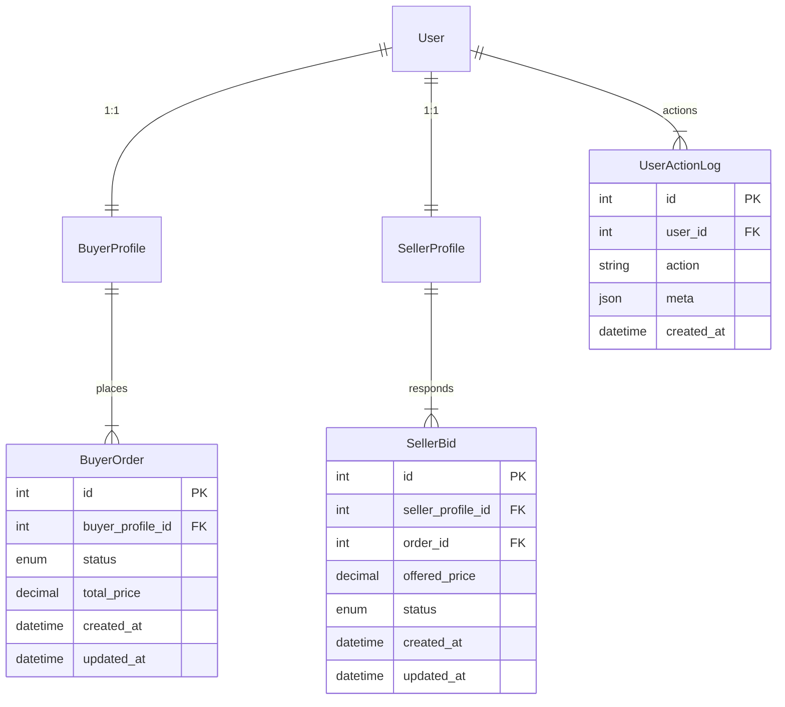

# Interface View-Mode Architecture

> **Context:** The marketplace exposes two distinct user contexts – **Buyer** and **Seller** – while persisting a **single** `User` entity in the database. This document defines how the web interface, routing layer, middleware, and supporting infrastructure separate those contexts without duplicating code or breaking SEO requirements.

## 0. Executive Summary

* A single `User` may optionally own `BuyerProfile` and/or `SellerProfile`.
* UI is namespace-segregated under URL prefixes `/buyer/**` and `/seller/**`.
* The active context is stored in the HTTP session (`request.session["view_mode"]`).
* A dedicated middleware attaches `request.view_mode` and enforces profile ownership.
* Navigation fragments are loaded dynamically based on the active mode.
* Significant user actions are persisted to a separate `UserActionLog` table.
* Canonical URLs and `sitemap.xml` guarantee SEO hygiene for both segments.

## 1. Domain Model (ER Diagram)


### Key Points
1. **Request–Response Workflow** – `BuyerOrder` represents a purchase request; `SellerBid` represents an offer against that request.
2. **Extensibility** – Additional tables (e.g. `Message`, `Invoice`, `Shipment`) can be added without altering profile schemas.
3. **Audit Trail** – `UserActionLog` is filled through Django signals (`post_save`, etc.).

## 2. Django Apps & Directory Layout
Each domain area resides in its own Django **app** following the *fat-service* pattern.
```plaintext
czesci/
└── czesci/
    ├── buyers/         # Views, serializers, templates for Buyer context
    ├── sellers/        # Views, serializers, templates for Seller context
    ├── common/         # Cross-cutting concerns (signals, permissions, mixins)
    └── users/          # Shared User, Profile, ActionLog models
```
Within every app:
* `urls.py`, `views.py`, `services.py` and `templates/<context>/…` live side-by-side.
* Common utilities belong to `common/` and are imported where required.

## 3. Routing & View-Mode Switching
`czesci/urls.py` (simplified):
```python
urlpatterns = [
    path("buyer/", include("buyers.urls")),
    path("seller/", include("sellers.urls")),
    path("",     include("public.urls")),  # Marketing pages
]
```
Switch view (pseudo-code):
```python
def switch_view(request, mode: str):
    if mode not in ("buyer", "seller"):
        return HttpResponseBadRequest()
    request.session["view_mode"] = mode
    return redirect("/" + mode + "/")
```
The switch is exposed via small **GET** endpoints (`/set-mode/buyer`, `/set-mode/seller`) and UI toggle buttons.

## 4. `CurrentModeMiddleware`
* Reads `session["view_mode"]`; if absent, infers from the URL prefix.
* Validates that the authenticated user possesses the required profile; otherwise **403** or **redirect** to profile creation flow.
* Injects `request.view_mode = "buyer" | "seller"` for later use.

## 5. Access Control
* Function-based views: decorators `@buyer_required` / `@seller_required` verify both `request.view_mode` **and** profile existence.
* Class-based views: mixins `BuyerRequiredMixin` / `SellerRequiredMixin` supply the same enforcement.
* **Fine-grained** rules can be built on top of [`django-rules`](https://github.com/dfunckt/django-rules).

## 6. Template System
The **root** `base.html` remains unified. Navigation bar is extracted into two partials:
```
templates/
├── fragments/
│   ├── nav_buyer.html
│   └── nav_seller.html
```
Embed in `base.html`:
```django

    

    

```

## 7. SEO Considerations
1. Every page sets `<link rel="canonical" href="{{ request.build_absolute_uri }}" />` using the **mode-prefixed** URL.
2. `sitemap.xml` is split into two top-level groups – `/buyer/…` and `/seller/…`.
3. `robots.txt` allows crawling of both prefixes while excluding duplicate non-prefixed pages.

## 8. User Action Logging
A generic logger persists important actions.
```python
class UserActionLog(models.Model):
    user   = models.ForeignKey(settings.AUTH_USER_MODEL, on_delete=models.CASCADE)
    action = models.CharField(max_length=64)
    meta   = JSONField(blank=True, default=dict)
    created_at = models.DateTimeField(auto_now_add=True)
```
Signal example (order placed):
```python
@receiver(post_save, sender=BuyerOrder)
def log_order_created(sender, instance, created, **kwargs):
    if created:
        UserActionLog.objects.create(
            user=instance.buyer_profile.user,
            action="buyer_order_created",
            meta={"order_id": instance.id},
        )
```

## 9. Alternatives & Trade-offs
| Variant                               | Pros                            | Cons                                          |
|---------------------------------------|---------------------------------|-----------------------------------------------|
| **Sub-domains** (`buyer.example.com`) | Clear SEO split, shared cookies | DNS setup, more complex local env             |
| **Two SPAs**                          | Full frontend separation        | Higher code duplication & deployment overhead |
| **Single URL + Tab UI**               | Less redirect logic             | Bloated router, weaker SEO clarity            |

The current **prefix** approach balances simplicity, SEO cleanliness, and explicit context for the user.

## 10. Implementation Steps
1. Scaffold `buyers`, `sellers`, and `common` apps.
2. Ensure existing `BuyerProfile` & `SellerProfile` migrations are applied.
3. Add `UserActionLog` model and hooks.
4. Implement `CurrentModeMiddleware` and register in `settings`.
5. Configure `urls.py` and context switch views.
6. Extract navigation fragments and patch `base.html`.
7. Write unit & integration tests for access control and switching.
8. Expand `sitemap.xml` & `robots.txt`.

---

_Authored by Anton (Technical Writer) – 2025-06-27_ 