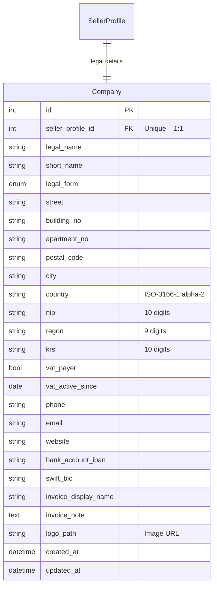

# Company Entity Architecture

> **Scope:** Define the structure and validation rules for storing **company data** required to issue invoices to **Polish** sellers (initial target market) with room for multi-country expansion.
>
> **Relationship:** Each `SellerProfile` owns **exactly one** `Company` record (`1:1`). Buyers presently do **not** require a company entity, but the model is reusable if this changes.

## 1. Entity-Relationship Overview


## 2. Field Catalogue & Rationale
| Field                                   | What it stores                              | Why it is needed                                               |
|-----------------------------------------|---------------------------------------------|----------------------------------------------------------------|
| `legal_name`                            | Full legal name (*"Auto-Parts Sp. z o.o."*) | Mandatory on every Polish invoice                              |
| `short_name`                            | Abbreviated name for UI use                 | Friendly display in dashboards                                 |
| `legal_form`                            | Enum: JD / SPZOO / SA / …                   | Additional clarity for legal documents                         |
| `street`, `building_no`, `apartment_no` | Normalised street & house/office number     | Easier validation vs single "address line"                     |
| `postal_code`                           | Format `NN-NNN`                             | Polish ZIP code appears on invoice                             |
| `city`                                  | City / locality                             | As above                                                       |
| `country`                               | ISO-3166-1 (default `PL`)                   | Future multi-country support                                   |
| `nip`                                   | 10-digit **NIP** (no `PL` prefix)           | Primary tax identifier; required                               |
| `regon`                                 | 9-digit **REGON**                           | Requested by most B2B clients                                  |
| `krs`                                   | National Court Register number              | Mandatory for *Sp. z o.o.*, *S.A.*                             |
| `vat_payer`                             | Registered VAT payer?                       | Determines whether to prepend `PL` to NIP on invoice           |
| `vat_active_since`                      | VAT registration date                       | Displayed when verifying counterparties                        |
| `bank_account_iban`                     | IBAN (`PL kk bbbb rrrr …`)                  | Required for wire transfers                                    |
| `swift_bic`                             | SWIFT/BIC code                              | For cross-border payments                                      |
| `phone`, `email`                        | Contact channels                            | Shown on invoice; values may reuse existing user phones/emails |
| `website`                               | Home page / e-shop                          | Nice-to-have for invoice footer                                |
| `invoice_display_name`                  | Override seller name on invoice             | Supports trading names different from `legal_name`             |
| `invoice_note`                          | Free-text note (e.g. payment terms)         | Quickly add personalised footer                                |

## 3. Django Model Specification
```python
class Company(models.Model):
    """Normalized legal & invoicing data for a seller."""

    # 1-to-1 with SellerProfile (define SellerProfile below or import)
    seller_profile = models.OneToOneField(
        "users.SellerProfile",
        on_delete=models.CASCADE,
        related_name="company",
    )

    # Identification
    legal_name = models.CharField(max_length=255)
    short_name = models.CharField(max_length=120, blank=True)
    LEGAL_FORMS = [
        ("JD", "Jednoosobowa działalność"),
        ("SPZOO", "Sp. z o.o."),
        ("SA", "Spółka Akcyjna"),
        # …extend when needed
    ]
    legal_form = models.CharField(max_length=30, choices=LEGAL_FORMS, default="JD")

    # Address
    street       = models.CharField(max_length=120)
    building_no  = models.CharField(max_length=20)
    apartment_no = models.CharField(max_length=20, blank=True)
    postal_code  = models.CharField(max_length=6)  # NN-NNN
    city         = models.CharField(max_length=64)
    country      = models.CharField(max_length=2, default="PL")

    # Identifiers
    nip   = models.CharField(max_length=10, unique=True)
    regon = models.CharField(max_length=9, blank=True)
    krs   = models.CharField(max_length=10, blank=True)

    # VAT status
    vat_payer        = models.BooleanField(default=True)
    vat_active_since = models.DateField(null=True, blank=True)

    # Contacts
    phone          = models.CharField(max_length=32, blank=True)
    email          = models.EmailField(blank=True)
    website        = models.URLField(blank=True)
    contact_person = models.CharField(max_length=120, blank=True)

    # Payments
    bank_account_iban = models.CharField(max_length=34, blank=True)
    swift_bic         = models.CharField(max_length=11, blank=True)

    # Invoice customisation
    invoice_display_name = models.CharField(max_length=255, blank=True)
    invoice_note         = models.TextField(blank=True)

    logo = models.ImageField(upload_to="logos/", blank=True)

    created_at = models.DateTimeField(auto_now_add=True)
    updated_at = models.DateTimeField(auto_now=True)

    class Meta:
        verbose_name = "company"
        verbose_name_plural = "companies"

    def __str__(self) -> str:
        return self.short_name or self.legal_name
```

### 3.1 Validation & Helpers
* **NIP / REGON / postal code** – validate using [`django-pl-vat`](https://pypi.org/project/django-pl-vat/) or custom regex.
* When `vat_payer=True`, render invoices with `PL{nip}`; otherwise just `nip`.
* Accept **only digits** for NIP/REGON; strip whitespace before saving.
* `country` must follow ISO-3166-1 alpha-2; default `PL`.
* Enforce the **1-to-1** rule via the `OneToOneField` plus DB **unique** constraint on `seller_profile`.

## 4. Future Extensions
1. **Multiple Addresses** – If legal vs operational addresses diverge, introduce reusable `Address` model (`type: legal | operational`).
2. **Internationalisation** – Add country-specific validators & legal forms.
3. **Bank Accounts** – Split into dedicated `BankAccount` entities (supporting multi-currency).
4. **PESEL for Sole Traders** – Optionally capture Polish personal ID.

## 5. Implementation Checklist
- [ ] Create `Company` model & migration.
- [ ] Backfill existing sellers (one company per profile) – values can be placeholder for MVP.
- [ ] Wire admin interface with inline editing under `SellerProfile`.
- [ ] Add serializer/schema for public API exposure.
- [ ] Unit tests: validators, unique constraints, string representation.

---

_Authored by Anton (Technical Writer) – 2025-06-27_ 