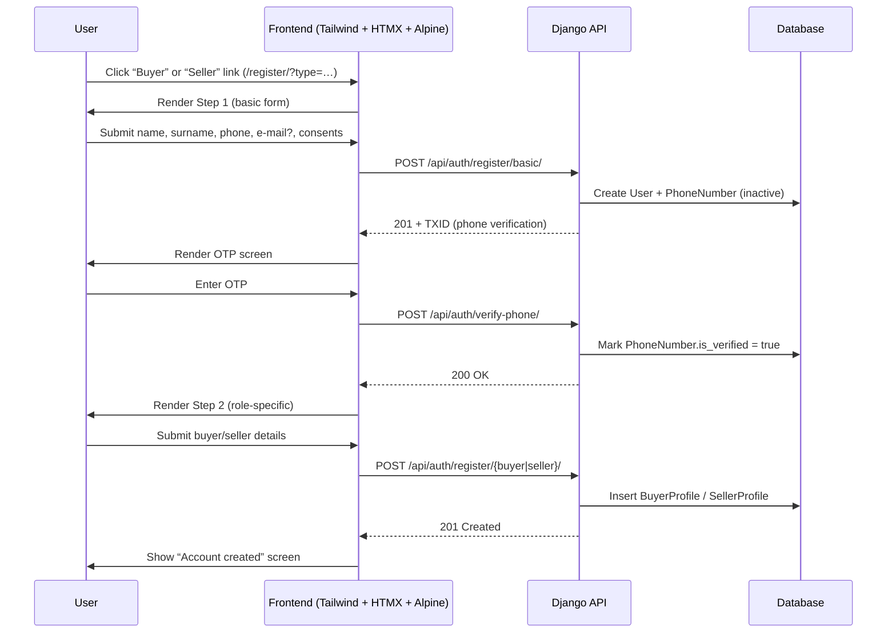

# Registration & On-Boarding Architecture

## Introduction
This document outlines the architecture of the **registration and onboarding flow** for the marketplace platform. The design adheres to the data-minimisation principle of GDPR (RODO) and aligns with the legal requirements specified in `003.1-personal-data-pl-en.md`.

The goal is to provide a seamless user experience while collecting **only** the data strictly necessary at each stage and ensuring clear legal bases for every processed field.

---

## High-Level Flow


---

## Data Collected per Step
| Step | Fields | Mandatory | Legal Basis |
|------|--------|-----------|-------------|
| 1 | `first_name`, `last_name`, `phone`, `email?`, `age ≥ 18`, consents | Name, phone, age, ToS & Privacy consents | RODO art. 6 (1)(b); UŚUDE art. 18 §1 |
| 2 (Buyer) | `delivery_address`, `nip?` | Address | RODO art. 6 (1)(b) |
| 2 (Seller – Sole Trader) | `business_name`, `business_address`, `nip`, `regon?`, `iban`, `id_document` | All except optional | RODO art. 6 (1)(b)&(c); AML art. 34 |
| 2 (Seller – Legal Entity) | `company_name`, `krs`, `nip`, `registered_office`, `iban`, `representative_*` | All | RODO art. 6 (1)(b)&(c); AML art. 34 |

---

## Backend Components
### Models
```mermaid
erDiagram
    USER }o--|| PHONE_NUMBER : uses
    USER ||--|| BUYER_PROFILE : has
    USER ||--|| SELLER_PROFILE : has
    CONSENT }o--|| USER : "belongs to"
    BUYER_PROFILE {
        text delivery_address
        varchar nip (nullable)
        timestamps
    }
    SELLER_PROFILE {
        enum legal_form
        varchar business_name
        text business_address
        varchar nip
        varchar regon (nullable)
        varchar krs (nullable)
        varchar iban
        varchar representative_name (nullable)
        varchar representative_position (nullable)
        file representative_authorisation_doc (nullable)
        file id_document (nullable)
        timestamps
    }
```
* **`PhoneNumber`** – stores the number and verification status (see `004.2a-phone-numbers-arch-en.md`).
* **`SellerProfile.legal_form`** ∈ `{sole_trader, legal_entity}` governs which nullable fields become **required**.

### Service Layer

| Service                                           | Responsibility                            |
|---------------------------------------------------|-------------------------------------------|
| `RegistrationService.register_basic()`            | Create `User` + `PhoneNumber`, send OTP   |
| `RegistrationService.verify_phone()`              | Validate OTP, mark number verified        |
| `RegistrationService.register_buyer(user, data)`  | Persist `BuyerProfile`                    |
| `RegistrationService.register_seller(user, data)` | Persist `SellerProfile` with `legal_form` |

All write operations are executed inside DB transactions to guarantee consistency.

---

## Frontend Architecture
1. **Tailwind CSS v4** – utility-first styling.
2. **HTMX** – progressive enhancement; each step is an `hx-target` fragment so the page never fully reloads.
3. **Alpine.js** – lightweight state management (OTP timer, input masking).
4. **Accessibility** – all form fields have proper labels and error summaries.

---

## Compliance & Security Checklist
- Collect **only** data listed in the table above (RODO art. 5(1)(c)).
- Log explicit consents (`terms`, `privacy`, `marketing`) in `Consent` table (+ timestamp, IP).
- SMS sent via OTP channel contain **no** marketing content (see §6 of legal document).
- All traffic is served over TLS 1.3.
- Password hashing relies on Django’s default.
- AML screening is triggered server-side after `SellerProfile` creation.

---

## Definition of Done
- [ ] Document approved by PO & Lead Dev.
- [ ] Models & migrations implemented; unit tests green.
- [ ] API endpoints `/register/basic/`, `/verify-phone/`, `/register/buyer/`, `/register/seller/` return 2xx/4xx statuses per spec.
- [ ] DPIA updated if scope of collected data changes.

---

_Authored by Anton (Technical Writer) – 2025-07-09_ 