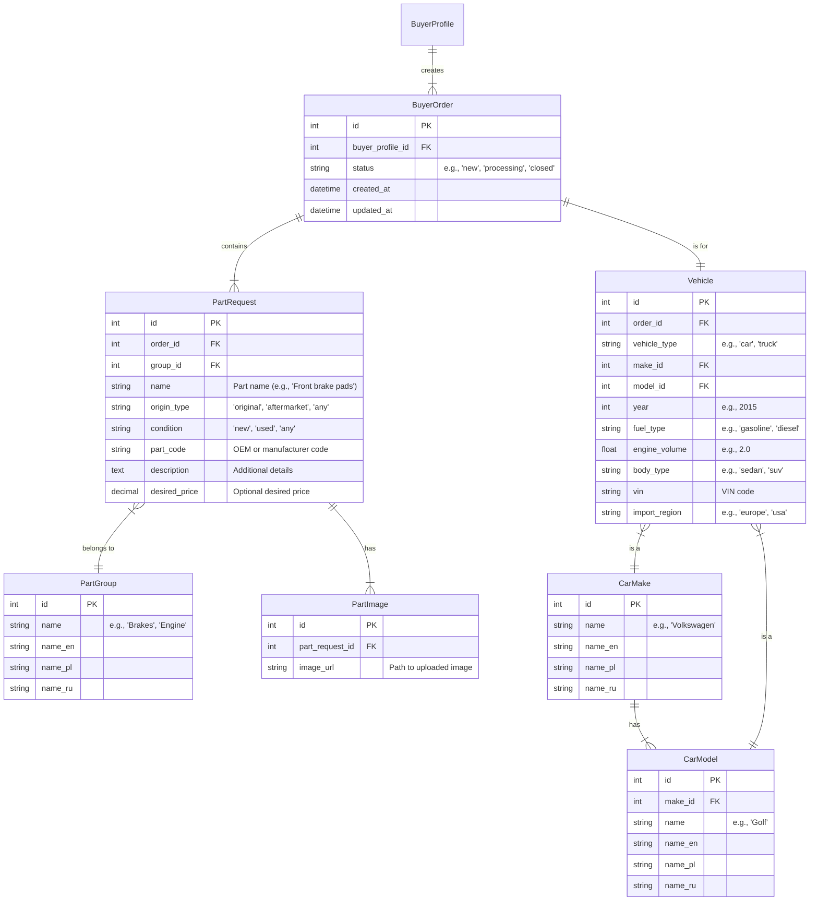

# Parts Order & Request Architecture

> **Scope:** This document defines the data models for creating a buyer's request for automotive parts (referred to as `BuyerOrder`). This architecture enables buyers to specify one vehicle and request multiple parts for it within a single order, aligning with the business requirement of up to 5 parts per request.

## 1. High-Level Overview

A `BuyerOrder` serves as the main container, linking a `BuyerProfile` to a specific `Vehicle` and one or more `PartRequest` entities. This structure normalizes vehicle information and allows for detailed specifications for each requested part, including photos and desired condition.

## 2. Django Model Specifications

### 2.1. New Application: `orders`

A new Django app named `orders` will be created to house these models.

### 2.2. Model Details

#### `BuyerOrder` (in `orders.models`)
- **Purpose:** The top-level container for a single parts request transaction.
- **Fields:**
    - `buyer_profile`: `ForeignKey` to `users.BuyerProfile`
    - `status`: `CharField` with choices (`new`, `processing`, `closed`). Default: `new`.
    - `created_at`, `updated_at`: From a common `TimeStampedModel`.

#### `Vehicle` (in `orders.models`)
- **Purpose:** Stores the details of the vehicle for which parts are being requested.
- **Fields:**
    - `order`: `OneToOneField` to `BuyerOrder`.
    - `vehicle_type`: `CharField` (e.g., 'car', 'truck').
    - `make`: `ForeignKey` to `handbooks.CarMake`.
    - `model`: `ForeignKey` to `handbooks.CarModel`.
    - `year`: `PositiveIntegerField`.
    - `fuel_type`: `CharField` (e.g., 'gasoline', 'diesel', 'electric').
    - `engine_volume`: `FloatField`.
    - `body_type`: `CharField` (e.g., 'sedan', 'suv', 'hatchback').
    - `vin`: `CharField`, optional, with validation.
    - `import_region`: `CharField`, optional (e.g., 'europe', 'usa').

#### `PartRequest` (in `orders.models`)
- **Purpose:** A single item within a `BuyerOrder`.
- **Fields:**
    - `order`: `ForeignKey` to `BuyerOrder`.
    - `group`: `ForeignKey` to `handbooks.PartGroup`.
    - `name`: `CharField` (with autocomplete from a handbook).
    - `origin_type`: `CharField` with choices (`original`, `aftermarket`, `any`).
    - `condition`: `CharField` with choices (`new`, `used`, `any`).
    - `part_code`: `CharField`, optional.
    - `description`: `TextField`, optional.
    - `desired_price`: `DecimalField`, optional.

#### `PartImage` (in `orders.models`)
- **Purpose:** Stores uploaded photos for a `PartRequest`.
- **Fields:**
    - `part_request`: `ForeignKey` to `PartRequest`.
    - `image`: `ImageField`.

### 2.3. Handbooks and Localization

- A new app, `handbooks`, will be created to store reference data like `CarMake`, `CarModel`, and `PartGroup`.
- These models will include fields for localization (e.g., `name_en`, `name_pl`, `name_ru`). We will use `django-modeltranslation` to manage this, providing a clean API.
- An import mechanism (e.g., management commands) will be created to populate these handbooks from CSV or other data sources.

## 3. Implementation Checklist
- [ ] Create `orders` and `handbooks` Django apps.
- [ ] Implement the models as specified above.
- [ ] Add the new apps to `INSTALLED_APPS`.
- [ ] Create and run migrations.
- [ ] Implement management commands for importing handbook data.
- [ ] Set up `django-modeltranslation` for localizable fields.

---
_Authored by Gemini Analyst – 2025-07-17_
