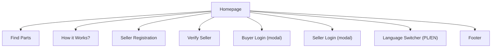

# Części Platform UI/UX Specification

## Introduction

This document defines the user experience goals, information architecture, primary user flows, and visual & interaction design specifications for the Części Platform's web interface.

- **Link to Primary Design Files:** _TBD_
- **Link to Deployed Storybook / Design System:** _TBD_

## Overall UX Goals & Principles

- **Target User Personas:**
  1. Buyer – wants to quickly find spare parts, compare sellers, and purchase confidently.
  2. Seller – aims to list spare parts efficiently and manage orders.
  3. Guest/Visitor – can browse recent listings but cannot view seller contact details.
- **Usability Goals:**
  - Fast search & discovery
  - Clear navigation
  - Minimal cognitive load
  - Error prevention & recovery
- **Design Principles:**
  1. Clarity over cleverness – every element communicates its purpose.
  2. Consistency – shared components & patterns across pages.
  3. Responsive first – seamless experience from mobile to desktop.
  4. Accessibility – WCAG 2.1 AA baseline; keyboard reachable menus & modals.
  5. Delight without distraction – subtle neumorphism styling, gentle shadows & soft colors.

## Information Architecture (IA)

### Site Map

### Navigation Structure

Primary navigation – top fixed bar (desktop) / top collapsible drawer (mobile):

1. Find Parts
2. How it Works?
3. Seller Registration
4. Verify Seller
5. Language switcher (dropdown PL / EN)
6. CTA Buttons: "Buyer Login", "Seller Login" (open modals)

Secondary navigation (footer):

- Terms of Use
- Privacy Policy
- Contacts
- (reserved space for future links)

## User Flows

_Work in progress – will include Login, Search, and Seller Onboarding flows._

## Wireframes & Mockups

_See primary design file link above. Key screens to be embedded once finalized._

## Component Library / Design System Reference

_TBD_

## Branding & Style Guide Reference

- **Color Palette:** _TBD_
- **Typography:** _TBD_
- **Iconography:** _TBD_
- **Spacing & Grid:** _TBD_

## Accessibility (AX) Requirements

- **Target Compliance:** WCAG 2.1 AA
- **Specific Requirements:**
  - Keyboard-reachable menus & modals
  - Sufficient color contrast
  - ARIA landmarks for complex components

## Responsiveness

- **Breakpoints:**
  - Mobile ≤ 768 px (md)
  - Desktop > 768 px
- **Adaptation Strategy:**
  - On mobile the primary menu collapses into a hamburger icon toggling an Alpine.js drawer.
  - Language switcher becomes part of the drawer list.
  - CTA login buttons stack horizontally within the drawer footer.
  - Neumorphic effects scale down (lighter shadows) to maintain performance on mobile.

## Change Log

| Change | Date | Version | Description | Author |
| ------ | ---- | ------- | ----------- | ------ |
| Initial draft aligned to documentation template | 2025-06-20 | 0.1 | Adopted standard UI/UX spec structure | Anton | 